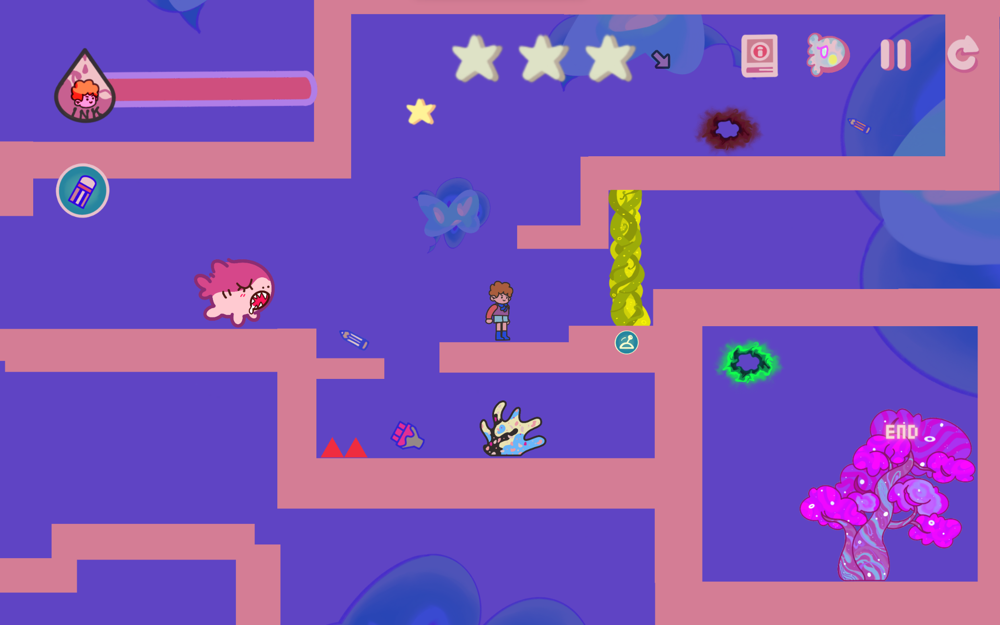

# Game Overview
Crazy Jack is a 2D platformer with a drawing mechanism.

Play Our Game: https://zhengyuwu0924.github.io/CSCI526_GroupAnxiety_Project/Play/Final

# Team Members
Yao Lin: Team Leader, responsible for task assignment, game design, level design, game structure and core mechanics programming.

Other members: Zhengyu Wu, Wanjing Yang, Jiayi Lan, Shengxian Tang, Wenxuan Du, Junhao Deng

# Game Details

The player can use different types of drawing tools with different properties and costs to draw to reach the goal in each level. Each level has ink limitation, the player needs to use ink in a proper way. The player can self-decide how to use the combinations of different drawing tools to help them clear the level. 

See Our Fianl Presentation Video: https://www.youtube.com/watch?v=LWYz-JTAXvM&t=23s

# Showcases

